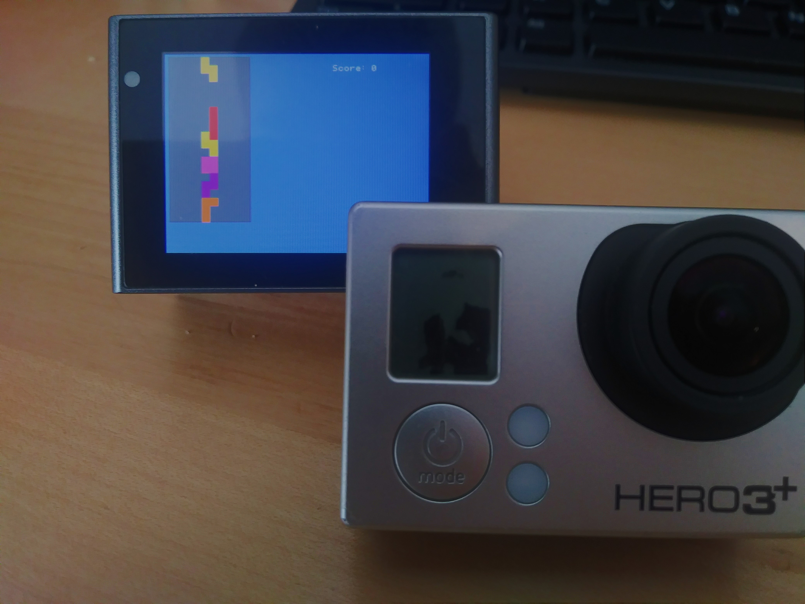

# Ambarella Hack Development Kit
Basically a CHDK/Magic Lantern clone for Ambarella based cameras.  
Has a GUI, hacks, games, unofficial documentation. Don't expect anything  
too polished at the moment.

Demonstration: https://www.youtube.com/watch?v=8iN3dRujXYc

# Goals
- [x] Magic Lantern/CHDK like GUI program loaded onto camera
- [x] Ambsh preprocessor + minimizer
- [x] Extensive Ambsh documentation
- [ ] Raw photo taking

# File Structure:
[ahdk](ahdk/) Contains the main AHDK UI and source code that is injected into the device.  
[ashp](ashp/) Ambsh parser. It adds extra features and generates a smaller ASH file.  
[loader](loader/) Ambsh script chooser, written in Ambsh.  
[platform](platform/) Contains model information and addresses/stubs.  
[test](test/) Bare bones assembly injection test. Generates autoexec.ash.  
[AMBSH.md](AMBSH.md) Contains extensive documentation on the Ambsh programming language.  
[tools/](tools/) HTML/JS web tools for AHDK. (image related things)  

# Building
Dependencies:
- Host gcc
- ARM GCC
- awk, ls, rm, touch, cp, make (typical Linux utilities)
Head into a directory and type `make help`.  
It should be pretty straightforward.  

This is the compiler used by Ambarella (I think). You should be able to  
use it to compile apps that run on the camera's Linux system.  
[arm-none-linux-gnueabi](https://sourcery.mentor.com/public/gnu_toolchain/arm-none-linux-gnueabi/arm-2011.09-70-arm-none-linux-gnueabi-i686-pc-linux-gnu.tar.bz2)  
It's older (2009), so it will generate assembly around 2x the size of newer GCCs.  
Personally, I use `gcc-arm-none-eabi-5_4-2016q3`, since it's the same compiler that Magic Lantern uses.  

# Help Needed
- Porting to other models
- Devising some kind of apps/modules system (?)
- Linker issues - see apps/link.c

# Thanks to
- http://spritesmods.com/?art=zx3hack&page=4 for the work done back in 2010
- The GoPrawn community https://www.goprawn.com/
- The entire camera hacking/reverse engineering community

## Other
- My testing cameras are the Activeon DX and GoPro Hero 3+
- Any help and/or questions are welcome . Just make an issue. 
- No warranty - If you break it, you keep both pieces.

